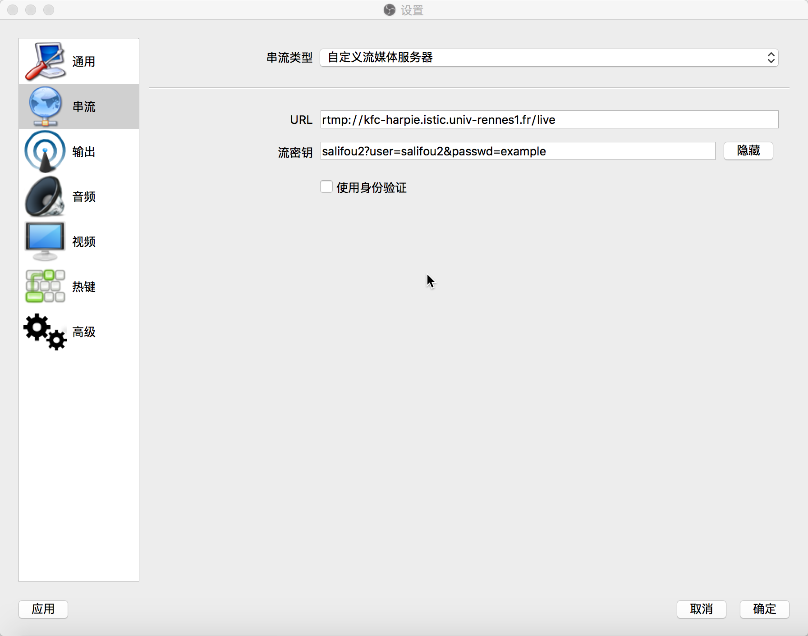
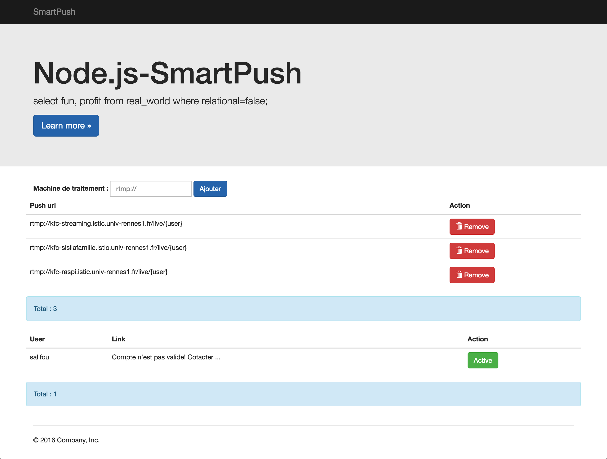

## SmartPush (Controler côté kfc-harpie)

一个高智商的自动分流服务，可以对流进行分服务器处理，这个也是核心服务，没有它直播都是浮云。它可以自动的处理接受到的流，然后进行自主选择。
为了方便管理添加了一个简单的`WebUI`，这个界面可以管理处理处理服务器，其中这些要写进配置文件。

Il a une jolie interface graphique en utilisant `Bootstrap 3`

* Ajouter/ Supprimer dynamiquement les machines de traitements
* Ban utilisateur
* API utile => format json


## Nginx-rtmp-module

这里用三个流处理服务器举例，

* kfc-raspi (Ubuntu 14.04)
* kfc-streaming
* kfc-sisilafamille

首先要安装 `ffmpeg`！ 没有它你什么都做不了。

Traitement le flux avec ffmpeg. Il faut installer `ffmpeg`.

再安装这个模块
https://github.com/arut/nginx-rtmp-module

## LNMP

感谢LNMP的作者，站在巨人的肩膀上，详情可以去 lnmp.org 去查看。

Si utilise lnmp c'est plus facile de configurer ce module-rtmp.

	wget -c http://soft.vpser.net/lnmp/lnmp1.2-full.tar.gz && tar zxf lnmp1.2-full.tar.gz && cd lnmp1.2-full && ./install.sh lnmp

puis installer nginx-rtmp-module
安装 `nginx-rtmp-module`

```bash
cd /root
git clone https://github.com/arut/nginx-rtmp-module.git

# 在lnmp1.*-full/include/upgrade_nginx中修改
Nginx_Modules_Options='--add-module=/root/nginx-rtmp-module'
./upgrade_niginx.sh
```

## ffmpeg

```bash
sudo add-apt-repository ppa:mc3man/trusty-media
sudo apt-get update
sudo apt-get install ffmpeg
```


## API

Example url: http://kfc-harpie:8080/api/{metode}

* listVm

```json
[
  "rtmp:\/\/kfc-streaming.istic.univ-rennes1.fr\/live",
  "rtmp:\/\/kfc-sisilafamille.istic.univ-rennes1.fr\/live",
  "rtmp:\/\/kfc-raspi.istic.univ-rennes1.fr\/live"
]
```

* list

```json
// cas invalide
[
  {
    "user": "salifou",
    "url": "Votre compte n'est pas valid\u00e9 !",
    "is_locked": 1
  }
]
// cas valide
[
  {
    "user": "salifou",
    "url": "rtmp://kfc-streaming.istic.univ-rennes1.fr/live/salifou",
    "is_locked": 0
  }
]

```

* info?user=xx

```json
{
  "info": {
    "identifiant": "salifou1",
    "is_locked": 0,
    "nom": "ben",
    "prenom": "ben",
    "email": "ben@maiga.fr"
  },
  // 推流地址是不变的
  "push_url": "rtmp://kfc-harpie.istic.univ-rennes1.fr/live",
  // key要客户自己加进去
  "key": "salifou1?user=salifou1&passwd=xxx"
}
```

## Configuration de Nginx-rtmp-module

```json
rtmp {
	server {
	listen 1935;
	chunk_size 4096;
	
		application live {
			allow publish all;
			deny publish all;
			live on;
			meta copy;
			# permettre de verifier si c'est bon. puis lancer ffmpeg donc le button de client peut supprimer :)
			on_publish http://127.0.0.1:8080/play;
			notify_method get;
		}
	}
}
```

## Configuration de KFC-*(traitement)

```json
rtmp {
	server {
		listen 1935;
		chunk_size 4096;
		
		application live {
			live on;
			record off;
			exec ffmpeg -i rtmp://localhost/live/$name -threads 1 -c:v libx264 -profile:v baseline -b:v 350K -s 640x360 -f flv -c:a aac -ac 1 -strict -2 -b:a 56k rtmp://localhost/live360p/$name;
			exec ffmpeg -i rtmp://localhost/live/$name -threads 1 -c:v libx264 -profile:v baseline -b:v 350K -s 858x480 -f flv -c:a aac -ac 1 -strict -2 -b:a 56k rtmp://localhost/live480p/$name;
			exec ffmpeg -i rtmp://localhost/live/$name -threads 1 -c:v libx264 -profile:v baseline -b:v 350K -s 1280x720 -f flv -c:a aac -ac 1 -strict -2 -b:a 56k rtmp://localhost/live720p/$name;
		}
		
		application live360p {
			live on;
			record off;
		}
		application live480p {
			live on;
			record off;
		}
		application live720p {
			live on;
			record off;
		}
		
		}
}
```

## HSL-Configuration de KFC-*(traitement)

Ajouter l'option dans confige, puis on peut avoir le format m3u8,
Example

```json
# HLS
# For HLS to work please create a directory in tmpfs (/tmp/hls here)
# for the fragments. The directory contents is served via HTTP (see
# http{} section in config)
#
# Incoming stream must be in H264/AAC. For iPhones use baseline H264
# profile (see ffmpeg example).
# This example creates RTMP stream from movie ready for HLS:
#
# ffmpeg -loglevel verbose -re -i movie.avi  -vcodec libx264
#    -vprofile baseline -acodec libmp3lame -ar 44100 -ac 1
#    -f flv rtmp://localhost:1935/hls/movie
#
# If you need to transcode live stream use 'exec' feature.
#
application hls {
	live on;
	hls on;
	hls_path /tmp/hls;
}

# MPEG-DASH is similar to HLS

application dash {
	live on;
	dash on;
	dash_path /tmp/dash;
}
```

## Example avec OBS
  
-  "push_url": "rtmp://kfc-harpie.istic.univ-rennes1.fr/live",

-  "key": "salifou1?user=salifou1&passwd=example"




Grace a module de node.js `morgan` on peut avoir des informations coté serveur.


## GUI pour KFC-Harpie




## Examples de vérification

* kfc-harpie

Un petit script pour vérifier la permission.

example: http://xxx/?user=`salifou`&passwd=`salifou`

```javascript

var http = require('http');
var url=require('url');

http.createServer(function (req, res) {
    var params = url.parse(req.url, true).query;
    if(params['user']==='salifou'&&params['passwd']==='salifou')
    {
        	res.writeHead(200, {'Content-Type': 'text/plain'});
        	res.end('ok');
    }else{
        res.writeHead(400, {'Content-Type': 'text/plain'});
        res.end('faild');
    }

}).listen(8080);
```
	
### forever start app.js
这个模块保证服务挂了之后满血复活。

```bash
$ sudo npm install forever -g   #安装
$ forever start app.js          #start/启动
$ forever stop app.js           #stop/关闭
```

## License Apache 2
World is powered by solitude
Je suis fort :)

