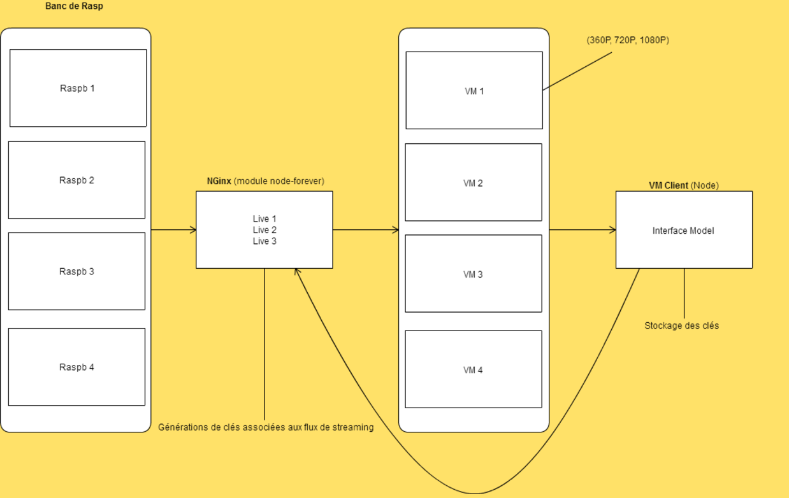

# Node.js+Nginx+Linux+Live Streaming

A solution of Live Streaming by using `Node.js` and `Nginx`
## Introduction

This is a project using `Node.js`, it's used for Live Streaming. You can add the resources from internet or use your own streaming.

You can use your phone, your camera or all the object which has a camera could be used for streaming.
This is the architecture of project, we can use the load balancing in our system. Thanks to `SmartPush` we can balance the requests in differences VM(Nginx with rtmp module). In `SmartPush` we have a REST-API for GUI. The latency is about 3 seconds.



This is a full solution of Live Streaming, you can find GUI in `Front-end` and Smart-Push in `Back-end` with all docs in each directory.


## Archi

``` bash
.
├── Back-end
│   ├── README.md
│   ├── SmartPush
│   └── img
├── Front-end
│   ├── Web
├── README.md
├── Raspberry
│   ├── README.md
│   ├── init.sh
│   └── vnc.sh
└── img
    ├── 1.png
    └── 2.JPG
```

## Documentation en Français

- [Rasberry (Caméra)](https://github.com/qfdk/projetESIR/tree/master/Raspberry
) 

- [Back-end (SmartPush system + kfc-* + kfc-nginx)](https://github.com/qfdk/projetESIR/tree/master/Linux)
 
- [Front-end (Client + player)](https://github.com/qfdk/projetESIR/tree/master/Web) 

## SQL for WEB

```
CREATE TABLE IF NOT EXISTS `login_web` (
  `nom` varchar(40) DEFAULT NULL,
  `prenom` varchar(40) DEFAULT NULL,
  `identifiant` varchar(40) NOT NULL,
  `mdp` varchar(40) NOT NULL,
  `email` varchar(100) NOT NULL,
  `is_locked` int(11) NOT NULL DEFAULT '0'
) ENGINE=InnoDB DEFAULT CHARSET=utf8;

```
## For Café (捐赠)
Paypal ：qfdk2010#gmail.com


## License Apache 2
World is powered by solitude

